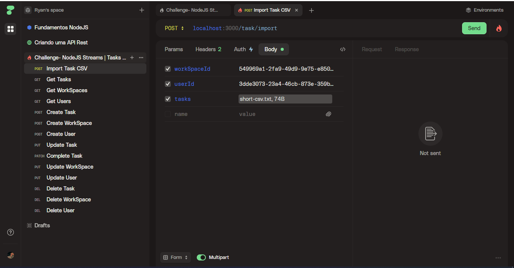

<h1>🔥NodeJS Fundamentals Challenge</h1>

<h2>☑Task Manager App</h2>

    The challenge is based on creating an API for a task management app, but using Node Streams to develop a task import feature from a CSV file.  
    As the course module only deals with node fundamentals, I created an api trying to limit myself to pure nodejs as much as possible, using only the "multer" libraries for file processing and "convert-csv-to-json" for converting the csv to JSON.  
    The data is being stored in memory inside a "db.json" file that is also read and written through streams.  
    As I already have some experience in NodeJs I ended up making my job more difficult and including a little more code.  
    To test the file import it is necessary to send a "multipart/form-data" in any HTTP client of your choice together with the "userId" and the "workSpaceId" to which the tasks of the file being imported refer.  <strong>Example:</strong>   

    ❗ The api is running on 3000 port!

 
<strong>
    <a href="https://efficient-sloth-d85.notion.site/Desafio-01-2d48608f47644519a408b438b52d913f">
        🔥 Challenge link
    </a>
</strong>

<h3>➡ Routes</h3>

<ul style="list-style-type: none">
    <h4>Default</h4>
    <li style="margin: 10px; font-size: 14px">GET /</li>
</ul>

<ul style="list-style-type: none;">
    <h4>User</h4>
    <li style="margin: 10px; font-size: 14px">GET /user</li>
    <li style="margin: 10px; font-size: 14px">POST /user</li>
    <li style="margin: 10px; font-size: 14px">PUT /user/:id</li>
    <li style="margin: 10px; font-size: 14px">DELETE /user/:id</li>
</ul>

<ul style="list-style-type: none">
    <h4>WorkSpace</h4>
    <li style="margin: 10px; font-size: 14px">GET /workspace</li>
    <li style="margin: 10px; font-size: 14px">POST /workspace</li>
    <li style="margin: 10px; font-size: 14px">PUT /workspace/:id</li>
    <li style="margin: 10px; font-size: 14px">DELETE /workspace/:id</li>
</ul>

<ul style="list-style-type: none">
    <h4>Task</h4>
    <li style="margin: 10px; font-size: 14px">GET /task</li>
    <li style="margin: 10px; font-size: 14px">POST /task</li>
    <li style="margin: 10px; font-size: 14px">POST /task/import</li>
    <li style="margin: 10px; font-size: 14px">PATCH /task/:id/complete</li>
    <li style="margin: 10px; font-size: 14px">PUT /task/:id</li>
    <li style="margin: 10px; font-size: 14px">DELETE /task/:id</li>
</ul>
